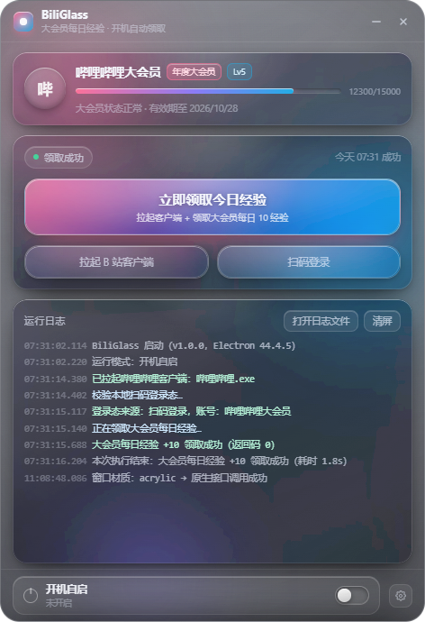

# BiliGlass · 大会员每日经验自动领取

一个 Windows 桌面小工具：**开机自动拉起哔哩哔哩客户端 → 自动领取大会员每日 10 经验**，界面为无边框液态玻璃（Liquid Glass）风格。



<sub>截图使用演示数据 · [设置面板预览](docs/screenshot-settings.png) · MIT License · Electron + Win32 原生调用 · 无需原生编译</sub>

```bash
git clone https://github.com/wsjb114514/bili-glass.git
cd bili-glass && npm install && npm start
```

```
┌──────────────────────────────────────┐
│ ● BiliGlass   大会员每日经验 · 开机  ─ ×│
├──────────────────────────────────────┤
│ ◯ 你的昵称  [年度大会员] [Lv5]        │   ← 账号卡（头像/大会员/等级经验）
│   ▓▓▓▓▓▓▓▓░░░░  12300/15000          │
├──────────────────────────────────────┤
│ ● 领取成功            今天 07:31 成功 │
│ ┌──────────────────────────────────┐ │
│ │      立即领取今日经验             │ │   ← 液态玻璃主按钮（高光跟随鼠标）
│ │  拉起客户端 + 领取每日 10 经验     │ │
│ └──────────────────────────────────┘ │
│ [ 拉起 B 站客户端 ]  [ 扫码登录 ]     │
├──────────────────────────────────────┤
│ 运行日志                 打开日志 清屏│
│ 07:31:15  大会员每日经验 +10 领取成功 │
├──────────────────────────────────────┤
│ ⏻ 开机自启  已开启 · 注册表      ⚙   │
└──────────────────────────────────────┘
```

---

## 一、快速开始

打包产物有两个，按需要选（都在 `dist\` 目录下）：

| 产物 | 说明 | 单次启动耗时（本机实测） |
| --- | --- | --- |
| `BiliGlass-1.0.0-安装版.exe` | **推荐用于开机自启**。一键静默安装到 `%LOCALAPPDATA%\Programs\BiliGlass`，免管理员；带开始菜单/桌面快捷方式与卸载程序 | 约 2 秒 |
| `BiliGlass-1.0.0-便携版.exe` | 免安装单文件，双击即用 | 约 28 秒（每次启动都要自解压约 500MB 到 `%TEMP%\BiliGlass`） |

> ⚠️ 便携版虽然“单文件免安装”，但每次启动都要解压一次，本机（软件渲染 + 机械盘/虚拟磁盘）实测要 28 秒；开机自启场景建议用**安装版**。如果坚持用便携版，请把它放到固定位置、不要移动或改名，否则自启会失效。

### 首次使用（三步）

1. 打开程序，点击 **扫码登录** → 用手机哔哩哔哩 App 扫码（我的 → 扫一扫）。
2. 回到主界面，看到账号卡显示昵称 + 大会员徽章即成功；点 **立即领取今日经验** 可先手动验证一次。
3. 点开底部 **开机自启** 开关，完成。之后每天开机自动执行，静默跑完只弹一张结果卡片。

### 方式 B：源码/开发模式

```powershell
npm install
npm start                  # 正常启动
npm start -- --autostart   # 模拟开机自启（静默执行 + 结果弹窗）
npm run dist               # 打包（便携版 + 安装版）
npm run dist:nsis          # 只打安装版
npm run dist:portable      # 只打便携版
```

> 安装依赖时若 npm 提示 `allow-scripts` 拦截了 `koffi` / `electron` 的安装脚本，需要手动补跑一次 Electron 二进制下载：
> ```powershell
> $env:ELECTRON_MIRROR="https://npmmirror.com/mirrors/electron/"
> cd node_modules\electron; node install.js
> ```

---

## 二、登录态是怎么来的

程序按 **扫码登录态 → 客户端登录态** 的顺序自动取用。设置里的「登录态优先级」决定**先试哪个**，但两种来源**都会尝试**：选「客户端优先」时，如果客户端取不到凭据，会自动回退使用已保存的扫码登录态（这个双向回退很关键，早先只有单向回退，导致选了「客户端优先」后明明刚扫码成功却提示「没有可用的登录态」）。

| 顺序 | 来源 | 说明 |
| --- | --- | --- |
| 1 | **扫码登录** | 用手机 App 扫码，凭据用 Windows DPAPI（当前用户密钥）加密后存在 `%APPDATA%\BiliGlass\credentials.dat`，只有本机当前用户能解密。B 站在访问时会顺带刷新 SESSDATA，程序会自动抓取并续期，尽量延长免扫码周期。 |
| 2 | **哔哩哔哩客户端登录态** | 从客户端 Electron 数据目录读取 `Network/Cookies`，用 DPAPI 解出 Chromium 主密钥后解密 `v10/v11` Cookie。 |

> ⚠️ **实测结论（重要）**：哔哩哔哩 PC 客户端 **1.17.6** 把账号登录态加密存放在自身配置文件（`config.json` / `store.json`）里，**不写网页 SESSDATA 到本地 Cookie 库**。所以在该版本下第 2 条路通常取不到凭据，程序会在日志里明确说明，并回退到扫码登录。老版本客户端或曾在客户端内置浏览器里登录过 B 站的情况下，这条路依然可用。
>
> 简单说：**请以扫码登录为主**，一次扫码通常能顶一个月左右，失效后开机会自动弹出二维码让你重扫。

---

## 三、开机自启怎么实现

两种方式，设置面板里可切换：

| 方式 | 实现 | 特点 |
| --- | --- | --- |
| 注册表（默认，免管理员） | `HKCU\Software\Microsoft\Windows\CurrentVersion\Run` 写入 `BiliGlass` 键，值为 `"程序路径" --autostart` | 免管理员，兼容性最好 |
| 计划任务 | `schtasks /create /sc onlogon`（任务名 `BiliGlass_Autostart`） | **实测需要管理员权限**，普通权限下会「拒绝访问」 |

> 程序对两种方式做了**自动回退**：如果创建计划任务被拒绝，会自动改用注册表方式完成登记，并在日志/界面上说明原因（配置里的「自启方式」也会同步改成实际生效的那种），不会出现「点了开关却什么都没发生」。

- **启动后延迟**：程序内部等待 N 秒（默认 12 秒）再开始执行，给系统和网络留出就绪时间。这段延迟统一由程序内部控制，计划任务侧不再叠加延迟。
- 开机自动执行**不会弹主界面**：后台静默跑完，只在右下角弹出一张结果卡片，看完点“关闭并退出”即可。
- 切换自启方式时程序会先清掉另一种方式，避免开机启动两次。
- 程序每次启动都会读注册表/计划任务真实状态并回写配置，界面显示与实际状态始终一致。

---

## 四、领取逻辑

1. 若当天已成功领取，跳过接口调用（避免不必要的请求）。
2. 按设置拉起哔哩哔哩客户端（已在运行则只唤起窗口），等待 N 秒让客户端就绪。
3. 解析登录态（扫码 → 客户端），并校验账号信息。
4. **模拟观看视频**（见下节）——B 站「观看视频」类任务是领取经验的前置条件。
5. 调用 `POST https://api.bilibili.com/x/vip/experience/add`（Cookie: SESSDATA，表单 csrf=bili_jct）领取每日 10 经验。
6. 领取失败时自动拉一次大会员任务面板做诊断，并复核经验值、写入本地记录与日志。

### 关于「先看 1 分钟视频」

B 站的「观看视频」不是点一下按钮就完成的，而是由**播放器每 15 秒向服务端上报一次播放心跳**累积出来的：

```
POST https://api.bilibili.com/x/click-interface/web/heartbeat
     ?w_aid=&w_cid=&w_playedtime=&w_realtime=&web_location=1315873
body: aid, bvid, cid, mid, played_time, realtime, real_played_time,
      video_duration, last_play_progress_time, max_play_progress_time,
      start_ts, type=3, sub_type=0, dt=2, outer=0, play_type, session, csrf
```

所以程序按**真实播放器的节奏**走完整个过程，而不是伪造一次请求：

| 顺序 | 动作 | play_type |
| --- | --- | --- |
| 1 | 开始播放（0s） | 1 开始播放 |
| 2 | 每 15 秒上报一次进度 | 0 播放中 |
| 3 | 达到设定时长（默认 62s）收尾 | 4 结束播放 |
| 4 | 追加一条观看历史 `x/v2/history/report` | — |

视频来源：默认从**排行榜**（`x/web-interface/ranking/v2`）里随机挑一个时长足够的视频（避免写死某个稿件被删），也可在设置里固定一个 BV 号。默认观看 62 秒，可在设置里调整（20~180 秒）。

> 实测记录：心跳接口在未登录状态下也会返回 `code: 0`，所以是否真正计入账号需要有效登录态；`x/v2/history/report` 则要求有效登录态（无效时返回 `-400`），属附加动作，失败不影响观看上报。

### 踩过的坑：Referer 会触发 412 风控

`x/web-interface/view` 这类接口对 Referer 有校验：

| Referer | 结果 |
| --- | --- |
| `https://www.bilibili.com/` | **HTTP 412**（风控拦截页） |
| `https://www.bilibili.com/video/<bvid>/` | 200 ✅ |

程序里所有接口都按「资源对应的页面」设置 Referer，并且对 412/403 做了退避重试。领取经验接口本身不校验 Referer（已实测：任意 Referer 都返回 200）。

### 窗口圆角与拖拽手感（Win10 实测踩坑）

这两个毛病其实是同一个根因：`SetWindowCompositionAttribute` **即使模糊不生效也会返回成功**。之前代码无条件调用它，于是在不支持模糊的机器上：

- 它给**整个窗口矩形**填了一层底色 → 盖掉了 CSS 圆角，窗口看起来是直角；
- 它那套模糊运算本身正是 Win10 **拖拽迟滞**的经典元凶（明明没生效还白吃性能）；
- 再加上 `hasShadow: true` 在圆角卡片背后画了一层矩形阴影，更显得「方」。

现在的处理：

| 措施 | 说明 |
| --- | --- |
| opaque 模式彻底关闭原生亚克力 | 调用 `ACCENT_DISABLED`，不再填色、不再有模糊开销 |
| 关闭系统阴影 | `hasShadow: false`，避免矩形阴影破坏圆角观感 |
| 8px 透明边距 + CSS 圆角 + 投影 | 窗口比内容大 16px，四周留给 `border-radius: 20px` 和 `box-shadow` 渲染，不再被窗口矩形裁掉 |
| 光斑去掉 `filter: blur(46px)` | 改用径向渐变柔边。软件渲染下大尺寸模糊滤镜每次重绘都要重算，是拖动卡顿的主因之一 |
| 轻量模式关闭光斑 `mix-blend-mode` 与动画 | 减少每帧合成的图层数 |
| **自绘拖拽** | 实测移动窗口时渲染进程稳定 60fps，瓶颈在 `-webkit-app-region: drag` 的系统模态拖拽循环。改为按屏幕光标位移自己移动窗口，并用 `GetAsyncKeyState(VK_LBUTTON)` 判断左键松开（鼠标移出窗口也能正确结束）。设置里可切回系统拖拽对比手感 |

验证方式：`tools/check-corner.ps1` 采样窗口正角落的像素——透明则圆角生效（实测正角落颜色 == 桌面颜色，第 14px 才进入窗口内容，符合 8px 边距 + 20px 半径的几何预期）。`--drag-bench` 可在拖动窗口的同时统计渲染帧率。

### 返回码处理

| code | 含义 | 程序行为 |
| --- | --- | --- |
| 0 | 领取成功 | 记录“领取成功” |
| 69198 | 今日已领取 | 视为正常，提示“已经领取过啦” |
| 235007 | 当前非有效大会员 | 明确提示需要大会员 |
| -101 | 账号未登录 | 提示登录态失效，弹出扫码 |
| -111 | csrf 校验失败 | 提示登录态不完整 |
| 6034007 | 请求过于频繁 | 提示稍后再试（不会重试轰炸） |

> 程序每天只发起**一次**领取请求 + 一轮观看上报（约 5 次心跳），远低于任何风控阈值。

---

## 五、设置项

| 分组 | 项 | 默认 |
| --- | --- | --- |
| 开机自启 | 开机自动执行 / 自启方式 / 启动后延迟 | 关 / 注册表 / 12s |
| 客户端 | 执行时拉起客户端 / 客户端路径 / 客户端就绪等待 | 开 / 自动检测 / 6s |
| 领取与登录态 | 自动领取 / **领取前模拟观看** / **观看时长 62s** / **指定视频号** / 登录态优先级 / 允许读取客户端登录态 | 开 / 开 / 62s / 空（自动挑） / 扫码优先 / 开 |
| 外观 | 窗口材质（亚克力 / 模糊 / 无） | 亚克力 |

> 开启「领取前模拟观看」后，一次完整执行约需 **80~100 秒**（客户端就绪 6s + 观看 62s + 接口调用）。开机自启场景下这是后台静默进行的，不影响你使用电脑。

**窗口材质说明**

- **亚克力**：调用 `user32!SetWindowCompositionAttribute`（`ACCENT_ENABLE_ACRYLICBLURBEHIND`），桌面内容真实磨砂，效果最好。
- **模糊**：同一接口的 `ACCENT_ENABLE_BLURBEHIND`，更省资源。
- **无**：纯 CSS，出现花屏或拖动卡顿时可切到这里。

**自动降级（实测踩坑）**：`SetWindowCompositionAttribute` **即使在模糊不生效的环境里也会返回成功**。在「软件渲染 / 无 DirectComposition」的机器上（虚拟机、部分远程桌面、显卡驱动异常）如果照它返回成功就当磨砂可用，窗口会变成**能看清桌面文字的半透明透视图**，界面可读性很差。

程序因此做了两件事：

1. 启动时读取 `app.getGPUFeatureStatus()`，软件渲染即判定原生模糊不可用；
2. 判定不可用时自动切到**不透明玻璃底**（深色渐变 + 三色光晕，观感依旧），并在日志里写明原因。

同时仍会自动切「轻量玻璃」：关闭 `backdrop-filter`、SVG 折射滤镜与位移动画，首帧因此从 **11 秒降到 1 秒**。

---

## 六、文件位置

| 内容 | 路径 |
| --- | --- |
| 配置 | `%APPDATA%\BiliGlass\config.json` |
| 加密登录态 | `%APPDATA%\BiliGlass\credentials.dat`（DPAPI 加密） |
| 日志 | `%APPDATA%\BiliGlass\logs\biliglass-YYYY-MM-DD.log` |

日志会同步显示在界面的「运行日志」面板里；设置面板里可一键打开日志文件或数据目录。

---

## 七、常见问题

**Q：点了“立即领取今日经验”，提示需要登录？**
扫码登录一次即可（主界面 → 扫码登录）。

**Q：提示「当前账号不是有效大会员」？**
该接口只对大会员开放每日 10 经验，普通账号无法领取。

**Q：开机后没看到弹窗？**
1. 看 `%APPDATA%\BiliGlass\logs\` 当天日志；
2. 确认自启已开启（界面底部开关 + 设置面板）；
3. 若用了便携版，确认 exe 没有被移动/删除；
4. 某些安全软件会拦截注册表 Run 写入，可改用「计划任务」方式。

**Q：窗口花屏 / 一片黑 / 拖动卡顿？**
设置 → 外观 → 窗口材质，依次试「模糊」「无」。

**Q：会不会泄露账号？**
不会。登录凭据只存在本机，用 Windows DPAPI 以「当前用户」为范围加密，其他用户或其他电脑都无法解密；程序不向任何第三方服务器发送数据，只直连 `api.bilibili.com` 与 `passport.bilibili.com`。

---

## 八、开发者工具

调试开关（都可与 `npm start --` 组合）：

| 参数 | 作用 |
| --- | --- |
| `--autostart` | 模拟开机自启：静默执行 + 结果弹窗 |
| `--view=main\|qr\|settings\|result\|result-demo\|demo` | 直接打开指定视图（`demo` 用假数据填充，便于截图/调样式） |
| `--shot=<png路径>` `--shot-delay=<ms>` `--shot-exit` | 渲染完成后自动截图（不受窗口 z-order 影响）并退出 |
| `--top` | 窗口强制置顶（截图用） |
| `--no-detect` | 跳过自启/客户端检测（排查性能用） |
| `--debug` | 输出启动耗时埋点（`[计时]` 日志） |

`tools/` 下附带自检脚本：

| 脚本 | 用途 |
| --- | --- |
| `node tools/test-core.js` | DPAPI 往返、客户端 Cookies 解密、账号信息接口、二维码接口 |
| `node tools/test-e2e.js` | 自启注册表开/查/关、客户端检测与进程探测、领取接口错误映射 |
| `node tools/test-watch.js` | 观看前置链路：排行榜挑视频、取稿件、心跳上报、历史上报 |
| `node tools/test-run.js` | 完整编排链路（拉起客户端 → 登录态 → 领取） |
| `node tools/test-order.js` | 打桩账号下的顺序校验：观看是否确实早于领取 |
| `node tools/test-real.js [--run]` | **用本机真实扫码登录态**校验：不加参数只读校验账号信息；加 `--run` 跑完整的观看+领取 |
| `node tools/test-autostart-task.js [--keep]` | 计划任务方式自启的创建/回读/删除（验证免管理员回退） |
| `node tools/probe-referer.js` | 探测各接口在什么 Referer 下不会吃 412 |
| `node tools/probe-412.js` | 对比 Referer / Cookie 对 412 的影响 |
| `node tools/test-koffi.js` | koffi 原生调用链自检（user32 / dwmapi / crypt32） |
| `node tools/make-icon.js` | 重新生成 `build/icon.ico`（多尺寸，纯自绘） |
| `node tools/debug-*.js` | 排查客户端/浏览器登录态存放位置 |
| `node tools/register-autostart.js enable\|disable\|status [exe路径]` | 直接用命令行登记/取消开机自启（默认登记便携版 exe） |
| `tools/shot.ps1` | 桌面整屏或指定窗口截图 |

---

## 九、目录结构

```
src/main/
  main.js           主进程：窗口、Acrylic 材质、IPC、自启编排
  preload.js        contextBridge 安全桥
  win32.js          koffi 直调 user32/dwmapi（亚克力 + Win11 圆角）
  store.js          配置持久化
  logger.js         日志（内存环形 + 落盘 + 推送到界面）
  autostart.js      注册表 / 计划任务自启（reg.exe、schtasks.exe）
  client.js         客户端定位、拉起、运行状态探测
  runner.js         一次完整执行：拉起客户端 → 登录态 → 观看 → 领取
  bili/
    api.js          扫码登录、nav、取稿件、播放心跳、历史上报、领取经验
    auth.js         登录态解析（扫码优先 + 客户端兜底 + 自动续期）
    watch.js        观看前置：排行榜挑视频 + 按真实播放器节奏上报心跳
    clientCookies.js 客户端 Cookies 读取与解密
    dpapi.js        Windows DPAPI（koffi 直调，PowerShell 兜底）
    sqlite.js       只读 SQLite（node:sqlite → sql.js 兜底）
src/renderer/
  index.html        界面结构 + 液态玻璃 SVG 滤镜
  styles/glass.css  液态玻璃视觉系统（折射/染色/高光/噪点/动效 + 轻量模式）
  js/app.js         界面逻辑
```

---

## 十、免责声明

- 本工具使用 B 站**非官方公开接口**完成领取操作，接口可能随官方调整而失效，届时请更新程序。
- 程序以极低频率请求（每天 1 次领取），但**仍存在被官方风控的潜在风险**，请自行评估、自行承担。
- 仅供个人学习与自用，请勿用于批量、多账号或其他违反 B 站用户协议的场景。
